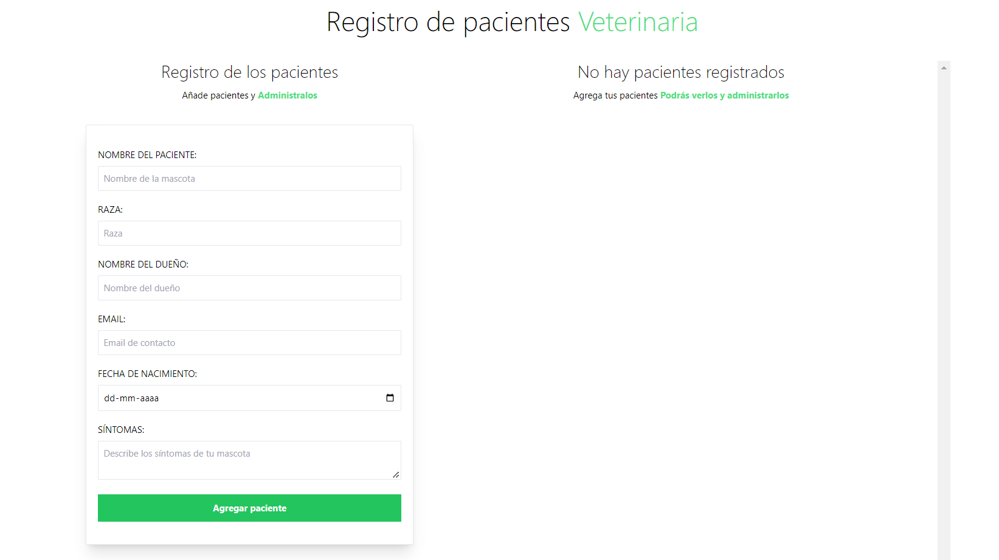
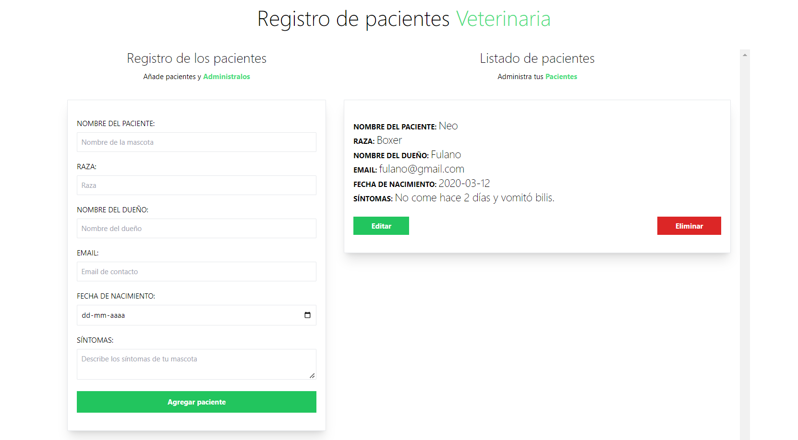

# Administrador de pacientes veterinaria
Un simple administrador de pacientes.

Se utilizó React, Vite.js, JS y Tailwind.css.

## Imagenes y Livepreview
Entra aquí para ver el livepreview:

->> [Live preview](https://clinquant-granita-a7b6f4.netlify.app/) <<-

Imagen 1:

Imagen 2:

